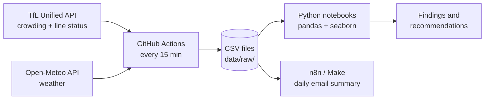

# London Tube Crowding: 30 Days of Live TfL Data

**When are London's busiest tube stations crowded, and what makes them busier than usual?**

An automated data pipeline that collects live crowding, line status and weather data every
15 minutes for 30 days (10 Oct – 8 Nov 2026), then analyses when stations are busy and why.

> 🚧 **Status:** data collection in progress. Analysis and findings will be added as data arrives.

## Why this project
✏️ *In your own words: why crowding matters (passenger comfort, safety, TfL's goal of spreading
demand to quieter times), and what you want to learn as an analyst (APIs, automation, data quality,
analysis).*

## Questions
1. When is each station busiest, and how do weekdays differ from weekends?
2. Do commuter stations (Bank, Canary Wharf) behave differently from leisure stations (Leicester Square, Oxford Circus)?
3. When is live crowding **higher or lower than TfL's typical pattern**, and what is it associated with:
   line disruptions, weather, events (football, Halloween, Bonfire Night), half-term, or the clock change?
4. Which lines are disrupted most, when, and for what reasons?

## How the pipeline works


- **Collect:** `scripts/collect.py` runs on GitHub Actions every ~15 minutes and appends rows to daily CSV files.
  The pipeline runs in the cloud, so collection does not depend on my laptop being on.
- **Store:** each run commits new data to this repository ("git scraping"), so every snapshot is versioned.
- **Reference:** `scripts/get_typical.py` downloads TfL's typical crowding pattern (7 days × 96 fifteen-minute slots) once, to compare against live data.
- **Analyse:** Jupyter notebooks in `notebooks/` (in progress).

## Data collected
| Dataset | Source | Endpoint | Frequency |
|---|---|---|---|
| Live station crowding | TfL Unified API | `/crowding/{naptan}/Live` | every 15 min |
| Line status and disruption reasons | TfL Unified API | `/Line/Mode/tube,elizabeth-line,overground,dlr/Status` | every 15 min |
| Weather (central London) | Open-Meteo | `/v1/forecast` | every 15 min |
| Typical crowding pattern | TfL Unified API | `/crowding/{naptan}` | once |

**Crowding measure:** `percentageOfBaseline` = current busyness compared with that station's busiest level since July 2019.
TfL's bands: **< 0.4 quiet**, **0.4–0.7 busy**, **> 0.7 very busy**.

## Stations
| Type | Stations |
|---|---|
| Commuter / offices | Waterloo, Liverpool Street, Bank, Canary Wharf |
| Rail interchange | King's Cross St Pancras, Victoria |
| Shopping / leisure | Oxford Circus, Leicester Square, Stratford |
| Tourist | Westminster |
| Events / football | Wembley Park, Finsbury Park |

## Repository structure
```
├── .github/workflows/collect.yml   # schedule (every 15 min)
├── scripts/collect.py              # collector
├── scripts/get_typical.py          # one-off: TfL typical pattern
├── data/raw/{crowding,status,weather}/YYYY-MM-DD.csv
├── data/reference/typical_crowding.csv
├── notebooks/                      # analysis (in progress)
└── reports/                        # findings (coming soon)
```

## Run it yourself
1. Get a free API key at [api-portal.tfl.gov.uk](https://api-portal.tfl.gov.uk/).
2. Create a `.env` file with `TFL_APP_KEY="your-key"`. It is git-ignored, so never commit it.
3. `pip install -r requirements.txt` then `python scripts/collect.py`.
4. For GitHub Actions, add the key as a repository secret called `TFL_APP_KEY`.

## Limitations (so far)
- Crowding values are **relative to each station's own peak**, so 0.6 at two stations is not the same number of people.
- Live crowding covers **tube stations only**. **Arsenal** returns no live data, so Finsbury Park is used for match days.
- GitHub's scheduler is best-effort, so runs can be delayed or skipped. The real measurement time (`tfl_time_utc`) is stored for every row.
- 30 days of data shows **associations, not causes**.

## Findings
*Coming after the collection ends on 8 November 2026.*

## Use of AI
✏️ *In your own words: e.g. "I used Claude to help set up the GitHub Actions pipeline and debug errors.
The research questions, analysis, interpretation and conclusions are my own."*

## Data and attribution
Powered by TfL Open Data. Contains OS data © Crown copyright and database rights 2016, and Geomni UK Map data © and database rights 2019.
Weather data by [Open-Meteo.com](https://open-meteo.com/) (CC BY 4.0).

---
**Author:** Mihir · MSc Business Analytics, Warwick Business School · 2026/27